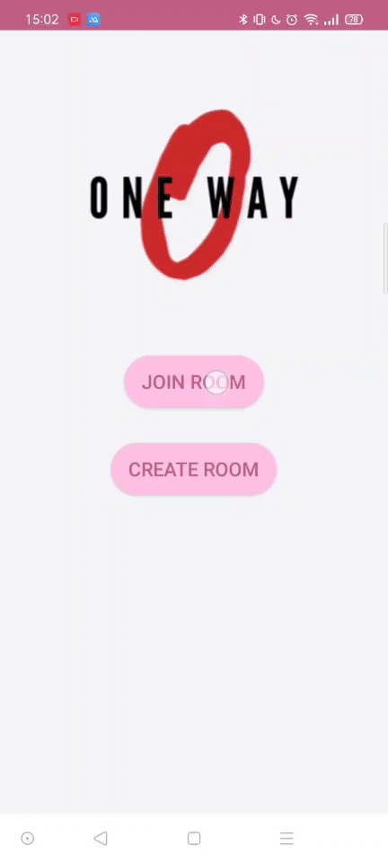

# OneWay

### OneWay is just an application use to test firebase's 'cloud' Firestore.

## description

The name OneWay is from the `One-way communication`.

This application will let user choose their roles:

- messager
- host

### messager

- can join a room

- can post some message to the room, with out their name

- they can't see the other message

### host

- can create a room

- can see all message in that room (msg from `messager`-unknow their name)

- can remove and pullback that message
